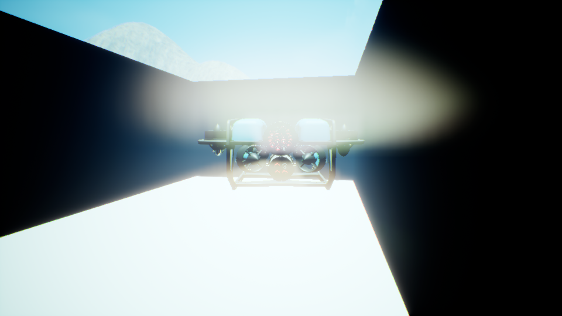
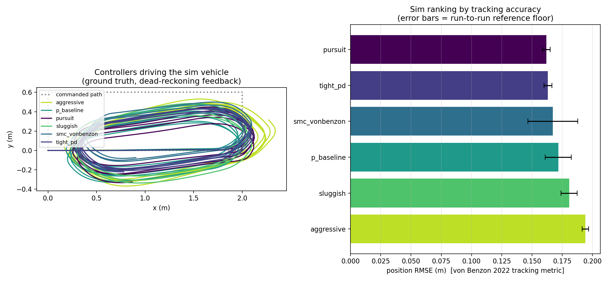

# Holo-for-CACMS: A Validated Virtual BlueROV2 in HoloOcean

A digital twin of our lab's BlueROV2 underwater robot, built on the
[HoloOcean](https://byu-holoocean.github.io/holoocean-docs/) simulator. The simulated
robot matches the real one in body, movement, sensors, sensor noise, and wire-format
conventions, and it swims in a spec-exact copy of the lab's Intex test pool. Our lab's
navigation code runs on it **unchanged**, and a controller-ranking benchmark is ready
for the lab's real controllers.

**Current fidelity: 34 of 41 statistical checks indistinguishable from real data** when
sim and real are compared in the same pool on the same maneuvers (35–37/41 on the older
open-water floors). The remaining misses are marginal and have a named mechanism (DVL
topic sample-and-hold, see Roadmap).


## The three things this repo does

**1. Publishes real-format sensor data from sim** (`sim/mavros_bridge.py`) — IMU, DVL,
depth topics that are field-for-field identical to the real vehicle's, including
measured noise, the accelerometer's sample-and-hold quirk, the DVL's raw FRD wire
convention and mount misalignment, and true (measured) sensor-only noise floors when
thrusters are idle. The lab's dead-reckoning stack consumes it unmodified.

**2. Scores how real the sim data is** (`sim/fidelity_scorecard.py`) — 41 statistical
distances per comparison (distribution, spectrum, temporal autocorrelation, windowed
MMD per channel) judged against a *reference floor* of real-to-real variation. The
pass criterion is itself calibrated on real data (`sim/threshold_study.py`): a
conformal margin that passes 95% of genuine real recordings, adopted after showing the
usual Mann-Whitney test wrongly fails 18% of them.

**3. Ranks controllers closed-loop** (`sim/waypoint_controller.py`,
`sim/lab_controller_adapter.py`, `sim/score_ranking.py`) — controllers fly the sim
vehicle on dead-reckoning feedback inside the pool twin; ranked by the community-
standard von Benzon 2022 metrics (RMSE/IAE). A lab controller ports by implementing
ONE `compute(obs) -> yaw_rate` class — no ROS code (see the adapter's docstring).
`sim/score_correlation.py` then computes the sim-vs-real ranking correlation — the
headline experiment once the real controllers and a pool session exist.

## Validation summary

| Part | How it was matched | Result |
|---|---|---|
| Vehicle body | Real flight logs confirm the standard 6-thruster BlueROV2 | exact configuration |
| Movement | Real thruster commands replayed through the model vs measured speeds | cruise within 5%, top speed within 0.4% |
| Axis conventions | Dedicated single-axis pool runs | surge +0.83, sway +0.89, yaw −0.97 (yaw inverted: MAVLink-CW vs ROS-CCW, confirmed in lab EKF source) |
| Sensor data | Formats/rates/frames/covariances from real recordings | field-for-field identical |
| Sensor noise | Armed/disarmed float tests: true sensor floors vs driving disturbance | sensor noise is 20–100× below in-mission floors; both modeled separately |
| Pool | Intex 26770 manual + published capacity: 4.0×2.0 m, 1.05 m water | exact; autonomous laps 100% contained |
| End to end | Lab dead-reckoning, unchanged, on sim data | ~3% drift, same as on real data |
| Statistical fidelity | 41 metrics vs calibrated real-real floor | 34/41 matched-venue |

Full write-up: [docs/BlueROV2_Simulation_Report.pdf](docs/BlueROV2_Simulation_Report.pdf)
· Real-session procedure: [docs/real_ranking_protocol.md](docs/real_ranking_protocol.md)

<p float="left">
  
  
</p>

## Setup (once)

Requirements: Linux with a GPU, ROS 2 (Humble or newer), and a GitHub account linked
to Epic Games (HoloOcean's install requires it).

```bash
# 1. python env that can see ROS (system python matching your ROS distro)
python3 -m venv --system-site-packages ~/holoocean-env

# 2. HoloOcean (private repo; needs the Epic-linked GitHub account)
git clone https://github.com/byu-holoocean/HoloOcean.git ~/holoocean
~/holoocean-env/bin/pip install ~/holoocean/client
~/holoocean-env/bin/python -c "import holoocean; holoocean.install('Ocean')"

# 3. this repo
git clone https://github.com/ChideraIbe123/Holo-for-CACMS.git
```

## Run it

```bash
source /opt/ros/humble/setup.bash
cd Holo-for-CACMS/sim
PY=~/holoocean-env/bin/python

# vehicle swims in the Intex pool twin, publishing real-format topics:
$PY mavros_bridge.py --headless --move --pool intex
ros2 topic echo /mavros/imu/data          # (another terminal)

# closed-loop: bridge + lab dead-reckon + a controller driving on its estimate
bash ../scripts/run_closedloop_test.sh

# controller-ranking benchmark in the pool twin (6 controllers x 2 seeds + scores):
bash ../scripts/run_benchmark_intex.sh

# fidelity campaign: replay real recordings, score vs the real-real floor
bash ../scripts/run_tub_campaign.sh       # expects bags/npz per the script header

# pool footage:
$PY indoor_pool_capture.py out_frames 90
```

Key `mavros_bridge.py` flags: `--pool intex` (spawn in the pool twin) · `--control`
(velocity autopilot driven by `/cmd_vel`) · `--replay prof.npz` (replay a real run:
commands + measured rotation rates + depth) · `--no-noise` · `--duration N`.

## What's in this repo

```
sim/   the simulator (run these)
  mavros_bridge.py            main program: HoloOcean + real-format ROS 2 topics
  bluerov2_standard_model.py  6-DOF physics of the standard BlueROV2
  scenario_bluerov.json       vehicle + sensor setup
  intex_pool.py               the lab pool's exact geometry (shared module)
  indoor_pool_capture.py      pool twin footage + containment verification
  pool_capture.py             legacy CRCE pool twin (validated vs 2026 pool bags)
  capture_video.py            open-water footage capture
  waypoint_controller.py      reference controllers (P/PD/pursuit/SMC), pool course
  lab_controller_adapter.py   drop-in slot for the lab's real controllers
  score_ranking.py            von Benzon RMSE/IAE ranking vs seed floor
  score_correlation.py        sim-vs-real ranking correlation (the paper metric)
  fidelity_scorecard.py       41-metric fidelity vs calibrated real-real floor
  threshold_study.py          calibrates the pass criterion on real data
  tubtest_floats.py           sensor-vs-vibration noise decomposition from floats
  extract_cmd_profile.py      real bag -> replayable profile (cmds, rates, depth)
  validate_model_vs_bag.py    physics model vs a real recording
  infer_signs_teleop.py       axis-sign check from piloted runs

tools/  standalone helpers
  bag_to_npz.py               bag -> npz for the scorecard
  bag_replayer.py             plays a real recording onto live ROS topics
  measure_noise_floor.py      sim-vs-real noise comparison
  record_run.py               records a sim run to npz
  sim_traj_recorder.py        odom + ground-truth CSVs (works on the real vehicle too)
  trajectory_recorder.py      estimated-vs-reference recorder + stats
  fit_noise_model.py          excitation-dependent noise fit

scripts/  one-command suites
  run_holoocean_verify.sh     full E2E check, simple estimator mode
  run_ekf_verify.sh           full E2E check, EKF mode (deployed vehicle config)
  run_replay_baseline.sh      real-data baseline (replay bag vs vendor DR)
  run_closedloop_test.sh      controller-in-the-loop E2E
  run_adapter_test.sh         lab-controller adapter E2E
  run_benchmark_intex.sh      controller ranking in the pool twin
  run_tub_campaign.sh         matched-venue fidelity campaign

docs/    report PDF + real ranking-session protocol
media/   figures and footage
```

## Conventions & gotchas (read before touching the bridge)

- **HoloOcean's IMU gravity is sign-flipped** vs a real IMU; the bridge corrects it
  (`GRAVITY_MODE='flip_gravity'`).
- **Acceleration control scheme is engine index 2**, not 1 — HoloOcean's python docs
  list the order wrong; the engine source is authoritative.
- **The real vehicle's angular rates and DVL wire format are FRD** relative to ROS's
  FLU (x same, y/z inverted) — confirmed empirically (sign gates) and in the lab's EKF
  source (`DVL_RAW_TO_BASE_LINK = diag(1,-1,-1)`). The bridge publishes the RAW wire
  convention (incl. the −1.848° DVL mount yaw); `--dvl-frame flu` for the old behavior.
- **Yaw command convention is inverted** (MAVLink manual-control CW-positive vs ROS
  CCW-positive): controllers run with `--yaw-sign -1`.
- **A DVL measures at its mount, not the vehicle center** — the bridge applies the
  lever arm (ω×r) from the lab's own `sensor_transforms.yaml`.
- **Real sensor noise is tiny** (gyro ~0.0004 rad/s); in-mission "noise" is mostly
  thruster/motion disturbance. The bridge injects true sensor floors when idle and
  excitation-dependent disturbance when driving; rotation/heave motion is trajectory-
  matched during replays (rate servos), because no noise model can produce real
  motion's positive increment autocorrelation.
- **The physics engine puts slow bodies to sleep** and then ignores forces;
  the pool scripts carry a watchdog that wakes the vehicle with a tiny teleport.
- **Run ONE bridge at a time** — concurrent bridges publish to the same topics.
- **Campaign pattern**: every fidelity/benchmark change reruns a full campaign and is
  judged by the scorecard — never by eye. Sign gates abort campaigns before wasting
  compute if a convention is wrong. All tunables are constants at the top of
  `mavros_bridge.py` / `bluerov2_standard_model.py`, each commented with its source.

## Roadmap (what's left)

1. **Real controllers** (ANFIS-DDPG / fuzzy / PPO) into `lab_controller_adapter.py`,
   rerun the pool benchmark, freeze the pre-registered sim ranking.
2. **Real ranking session** per `docs/real_ranking_protocol.md` (course: 2.0×0.6 m —
   a 3×3 m course does not fit the 4×2 m pool), then `score_correlation.py` for the
   sim-vs-real ranking correlation.
3. Model the DVL topic's duplicate-sample republication (the last marginal fidelity
   misses), using the 2026-09-17 tub recordings.

## Sources

- [HoloOcean](https://byu-holoocean.github.io/holoocean-docs/) (BYU FRoStLab)
- Wu (2018), Flinders University: 6-DoF modelling of the BlueROV2 (model coefficients)
- von Benzon et al. (2022), JMSE: benchmark metrics, SMC baseline, T200 thrust curve
- [clydemcqueen/bluerov2_gz](https://github.com/clydemcqueen/bluerov2_gz): thruster geometry
- ArduSub `AP_Motors6DOF`: motor mixing convention
- AUVSL `BlueROV-Tools`: deployed EKF conventions, sensor transforms, static noise notes
