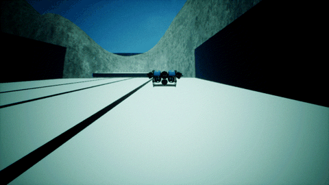
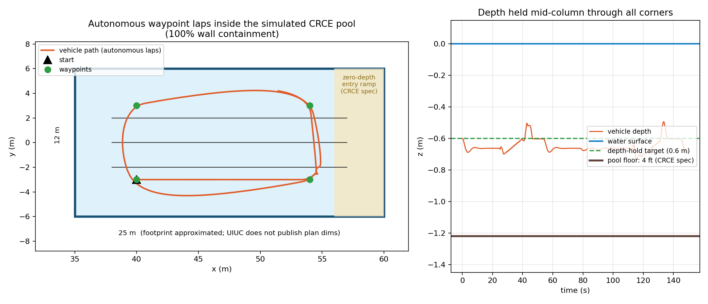
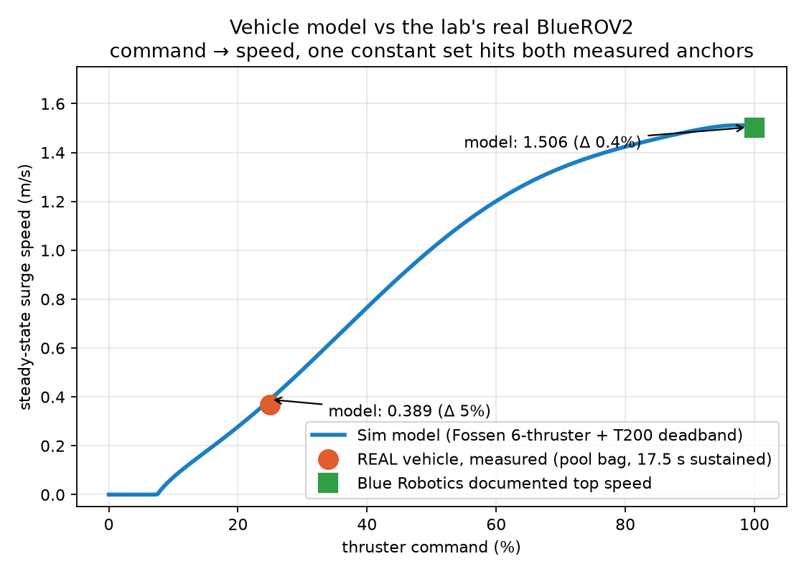

# Holo-for-CACMS: A Validated Virtual BlueROV2 in HoloOcean

A simulation of our lab's BlueROV2 underwater robot, built on the
[HoloOcean](https://byu-holoocean.github.io/holoocean-docs/) simulator. The simulated
robot matches the real one in body, movement, sensors, and sensor noise, and it swims
in a virtual copy of the CRCE pool where we run our real tests. Our lab's navigation
code runs on it **unchanged** and performs the same as it does on real pool data.



## Why this exists

Testing navigation algorithms in a real pool is slow, and you never know the robot's
true position. This simulator gives us repeatable experiments with perfect ground
truth, using data that looks exactly like what the real robot produces.

## What "validated" means here

Every part was checked against real data, not just built from specs:

| Part | How it was matched | Result |
|---|---|---|
| Vehicle body | Real flight logs confirm our standard 6-thruster BlueROV2; physics built to that config | exact configuration |
| Movement | Replayed real thruster commands from a pool test through the model, compared to measured speeds | cruise within 5%, top speed within 0.4% |
| Sensor data | Formats, rates, frame ids, covariances copied from a real recording | field-for-field identical |
| Sensor noise | Measured from real recordings, injected into the sim, re-measured | every axis within 15% |
| Pool | CRCE specs: 4 ft depth, zero-entry ramp (footprint approximated, not published) | height above floor: sim 0.58 m vs real 0.57 m |
| End to end | Lab dead-reckoning code, unchanged, on sim data | ~3% drift, same as on real data |

Full results with figures: [docs/BlueROV2_Simulation_Report.pdf](docs/BlueROV2_Simulation_Report.pdf)

<p float="left">
  
  
</p>

## What's in this repo

```
sim/       the simulator code (run these)
  mavros_bridge.py            main program: runs HoloOcean + publishes the robot's
                              ROS 2 topics (/mavros/imu/data, /dvl/twist, depth, ...)
  bluerov2_standard_model.py  physics of the standard 6-thruster BlueROV2
  scenario_bluerov.json       vehicle + sensor setup (rates, noise levels)
  pool_capture.py             builds the virtual CRCE pool and records footage
  capture_video.py            open-water footage capture
  validate_model_vs_bag.py    checks the physics model against a real recording

tools/     standalone helpers
  measure_noise_floor.py      compares sim sensor noise to the real vehicle
  bag_replayer.py             plays a real .mcap recording onto live ROS topics
  trajectory_recorder.py      records estimated vs reference position to CSV
  sim_traj_recorder.py        same, for sim runs (odom vs ground truth)

scripts/   one-command test suites (run on the machine hosting the sim)
  run_holoocean_verify.sh     full check, simple estimator mode
  run_ekf_verify.sh           full check, EKF mode (the default on the vehicle)
  run_replay_baseline.sh      replays a real recording as a reference baseline

docs/      the results report (PDF)
media/     figures and footage frames
```

## Setup (once)

Requirements: Linux with a GPU, ROS 2 (Humble or newer), and a GitHub account
linked to Epic Games (HoloOcean's install requires it).

```bash
# 1. python env that can see ROS (use your system python that matches your ROS distro)
python3 -m venv --system-site-packages ~/holoocean-env

# 2. HoloOcean (private repo; needs the Epic-linked GitHub account)
git clone https://github.com/byu-holoocean/HoloOcean.git ~/holoocean
~/holoocean-env/bin/pip install ~/holoocean/client
~/holoocean-env/bin/python -c "import holoocean; holoocean.install('Ocean')"

# 3. this repo's sim code
git clone https://github.com/ChideraIbe123/Holo-for-CACMS.git
```

## Run it

```bash
source /opt/ros/humble/setup.bash
cd Holo-for-CACMS/sim

# robot swims (scripted path) and publishes real-format sensor topics:
~/holoocean-env/bin/python mavros_bridge.py --headless --move

# in another terminal: watch the data
ros2 topic echo /mavros/imu/data

# virtual CRCE pool run with footage:
~/holoocean-env/bin/python pool_capture.py out_frames 150
```

Useful flags for `mavros_bridge.py`:
- `--no-noise` : clean data (turns off all sensor noise)
- `--dynamics builtin` : use HoloOcean's built-in Heavy vehicle instead of our model
- `--duration N` : stop after N simulated seconds

## Things future maintainers should know

- **HoloOcean's IMU gravity is sign-flipped** vs a real IMU. The bridge corrects it
  (`GRAVITY_MODE='flip_gravity'` in `mavros_bridge.py`).
- **The acceleration control scheme is index 2**, not 1 — HoloOcean's python docs
  list the order wrong; the engine source is authoritative.
- All tunable numbers (frame ids, covariances, noise levels, thrust/drag scales) are
  constants at the top of `mavros_bridge.py` and `bluerov2_standard_model.py`, each
  with a comment saying where its value came from.
- The pool footprint (25 m x 12 m) is an approximation; the depth and entry ramp are
  from the published CRCE specs.
- **The physics engine puts slow bodies to sleep** and then ignores applied forces
  (the vehicle can freeze mid-run after slowing for a turn). `pool_capture.py` has a
  watchdog that wakes it with a tiny teleport; keep it if you write new control loops.
  `pool_debug.py` is the no-camera diagnostic used to find this.
- Vehicle drag/added-mass coefficients come from published system identification of
  the BlueROV2 (Wu 2018) plus a thrust calibration against our own pool recording.
  When the lab measures its own coefficients, they drop into
  `bluerov2_standard_model.py`.

## Sources

- [HoloOcean](https://byu-holoocean.github.io/holoocean-docs/) (BYU FRoStLab)
- Wu (2018), Flinders University: 6-DoF modelling of the BlueROV2 (model coefficients)
- von Benzon et al. (2022), JMSE: T200 thruster force curve
- [clydemcqueen/bluerov2_gz](https://github.com/clydemcqueen/bluerov2_gz): standard-config thruster geometry
- ArduSub `AP_Motors6DOF`: motor mixing convention
